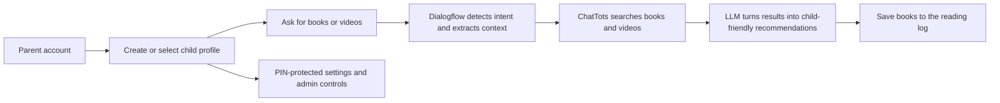

# ChatTots

ChatTots is a profile-aware discovery platform that helps parents and children find age-appropriate books and videos through a playful chat interface, persistent child profiles, and admin-managed content controls.



## Problem and Business Value

Parents often have to search across multiple apps, websites, and video platforms to find content that is both interesting and age-appropriate for a child. That gets even harder when one household has multiple children with different ages, reading levels, and interests.

ChatTots is designed to reduce that friction. It gives families a single, conversational interface for content discovery, keeps recommendations separated by child profile, remembers prior results to reduce repetition, and adds moderation controls so parents and admins can shape the recommendation experience instead of leaving it entirely to raw search results.

From a product perspective, that means:

- faster discovery of relevant books and videos
- safer, more age-aware recommendations for children
- profile-specific personalization for multi-child households
- reusable engagement data through chat history, reading logs, and recommendation memory
- operational control through admin-managed genres, synonyms, and activity visibility

## Core Tech Stack

| Area | Tools |
| --- | --- |
| Frontend | Next.js 15 App Router, React 19, TypeScript, Tailwind CSS |
| Backend | Next.js Route Handlers, Node.js runtime, Firebase Admin SDK |
| Auth and Data | Firebase Authentication, Cloud Firestore |
| NLP and Recommendation Orchestration | Google Dialogflow ES, OpenRouter |
| Content Sources | Google Books API, Open Library API, YouTube Data API, National Library Board Open API |
| Admin and Tooling | Firestore security rules, ts-node script for admin bootstrap, npm |

## Key Features and Technical Impact

- Profile-aware recommendations: each child gets a separate profile with their own age, interests, favorite color, chat history, reading log, and recommendation memory.
- Hybrid recommendation pipeline: Dialogflow handles intent and parameter extraction, while the server route combines profile data, Firestore genre metadata, and live third-party API results.
- Multi-source book discovery: book recommendations can be assembled from Google Books, Open Library, and Singapore's National Library Board catalogue, which broadens coverage and reduces single-provider dependency.
- Video discovery with safety checks: YouTube results are filtered for embeddability and basic playback constraints before they are shown in the UI.
- LLM-powered age filtering and summaries: OpenRouter is used to filter age-appropriate book results and turn raw search data into child-friendly summaries and recommendation copy.
- Recommendation deduplication across chats: Firestore stores global recommendation history and per-genre pagination context so the app can avoid repeating the same titles and videos every time a child asks for more.
- Persistent conversational UX: chat sessions are stored per child profile, searchable in the UI, and support follow-up flows such as "more recommendations."
- Reading log workflow: books can be saved from chat directly into a reading log with statuses such as `to-read`, `reading`, `completed`, and `dropped`.
- Parental safeguards: account settings are gated by a parental PIN, and profile deletion also requires PIN verification.
- Admin governance: admins can manage users, inspect profile data and activity logs, maintain book and content genres, and sync Firestore-defined genre vocabularies back to Dialogflow entity types.

## Recommendation Pipeline

1. A parent logs in, selects a child profile, and opens or creates a chat session.
2. The client sends the message, `userId`, `profileId`, `chatId`, and profile-preference toggle to [`src/app/api/dialogflow/route.js`](src/app/api/dialogflow/route.js).
3. The route uses Dialogflow to resolve intent, age, and genre context, then blends that with child-profile interests stored in Firestore.
4. Depending on the request, ChatTots queries book or video providers and uses OpenRouter to filter or summarize the results for a child audience.
5. The API stores chat history, recommendation memory, and pagination state in Firestore so later follow-up prompts can continue the same recommendation trail without unnecessary repetition.

## System Architecture Diagram

```mermaid
flowchart LR
    subgraph Client
        UI[Next.js App Router UI]
    end

    subgraph Firebase
        AUTH[Firebase Auth]
        FS[(Cloud Firestore)]
        ADMIN[Firebase Admin SDK]
    end

    subgraph Orchestration
        CHATAPI[/api/dialogflow]
        ADMINAPI[/api/admin/*]
        DF[Dialogflow ES]
        LLM[OpenRouter]
    end

    subgraph External_Content
        GB[Google Books]
        OL[Open Library]
        NLB[NLB Catalogue]
        YT[YouTube Data API]
    end

    UI --> AUTH
    UI --> FS
    UI --> CHATAPI
    UI --> ADMINAPI

    CHATAPI --> DF
    CHATAPI --> LLM
    CHATAPI --> GB
    CHATAPI --> OL
    CHATAPI --> NLB
    CHATAPI --> YT
    CHATAPI --> ADMIN
    ADMIN --> FS

    ADMINAPI --> ADMIN
    ADMINAPI --> FS
    ADMINAPI --> DF
```

## Firestore Data Model

| Path | Purpose |
| --- | --- |
| `users/{uid}` | Parent account metadata such as username, DOB, email, and parental PIN |
| `chats/{uid}/profiles/{profileId}` | Child profile record including interests and NLB preference |
| `chats/{uid}/profiles/{profileId}/chatSessions/{chatId}` | Saved chat metadata |
| `chats/{uid}/profiles/{profileId}/chatSessions/{chatId}/messages/{messageId}` | Stored user and bot messages |
| `chats/{uid}/profiles/{profileId}/readingLog/{logId}` | Saved books and reading status |
| `chats/{uid}/profiles/{profileId}/globalRecommendations/{docId}` | Cross-chat deduplication memory |
| `chats/{uid}/profiles/{profileId}/genrePaginationContext/{genreKey}` | Per-genre pagination and unshown items |
| `bookGenres/{genreId}` | Admin-managed book genres, synonyms, and optional emoji |
| `contentGenres/{genreId}` | Admin-managed video/content genres, synonyms, and optional emoji |
| `activityLogs/{uid}/activities/{activityId}` | User activity trail for admin review |

## Quick Start

### 1. Clone and install

```bash
git clone https://github.com/ishnad/chattots-public.git
cd chattots-public
npm install
```

### 2. Create local environment variables

```bash
cp .env.example .env.local
# PowerShell: Copy-Item .env.example .env.local
```

Then fill in the values in `.env.local`.

### 3. Start the development server

```bash
npm run dev
```

Open `http://localhost:3000`.

### 4. Create your first user

1. Go to `/signup`.
2. Create a parent account with a 4-digit parental PIN.
3. Log in and create one or more child profiles.

### 5. Optional: bootstrap admin access

If you want to use the admin dashboard:

1. Create a normal user first so the account exists in Firebase Authentication.
2. Open [`scripts/set-initial-admin.ts`](scripts/set-initial-admin.ts).
3. Replace the hard-coded `targetUserUid` with the UID you want to promote.
4. Run:

```bash
npx ts-node scripts/set-initial-admin.ts
```

After that, sign in at `/admin`.

### 6. Seed or manage genres

ChatTots expects `bookGenres` and `contentGenres` collections in Firestore.

You have two ways to populate them:

- manage them manually from `/admin/book-genres` and `/admin/content-genres`
- call the admin-only seed endpoints, which load the bundled JSON files from [`src/data/bookGenres.json`](src/data/bookGenres.json) and [`src/data/contentGenres.json`](src/data/contentGenres.json)

## Environment Variables

ChatTots expects a `.env.local` file. The included [`.env.example`](.env.example) file documents the full set.

| Variable | Required | Purpose |
| --- | --- | --- |
| `NEXT_PUBLIC_FIREBASE_API_KEY` | Yes | Firebase web app config for the client |
| `NEXT_PUBLIC_FIREBASE_AUTH_DOMAIN` | Yes | Firebase Auth domain |
| `NEXT_PUBLIC_FIREBASE_PROJECT_ID` | Yes | Firebase project ID used by the web client |
| `NEXT_PUBLIC_FIREBASE_STORAGE_BUCKET` | Yes | Firebase Storage bucket |
| `NEXT_PUBLIC_FIREBASE_MESSAGING_SENDER_ID` | Yes | Firebase messaging sender ID |
| `NEXT_PUBLIC_FIREBASE_APP_ID` | Yes | Firebase app ID |
| `NEXT_PUBLIC_FIREBASE_MEASUREMENT_ID` | Optional | Firebase Analytics measurement ID |
| `FIREBASE_PROJECT_ID` | Yes | Firebase Admin SDK project ID |
| `FIREBASE_CLIENT_EMAIL` | Yes | Firebase Admin SDK client email |
| `FIREBASE_PRIVATE_KEY` | Yes | Firebase Admin SDK private key with escaped newlines |
| `NEXT_PUBLIC_GOOGLE_PROJECT_ID` | Yes | Google Cloud project ID used for Dialogflow and admin links |
| `DIALOGFLOW_CREDENTIALS` | Yes | Dialogflow service-account JSON, stored as a single-line string |
| `GOOGLE_BOOKS_API_KEY` | Yes | Google Books API key |
| `YOUTUBE_API_KEY` | Yes | YouTube Data API key |
| `OPENROUTER_API_KEY` | Yes | OpenRouter API key for summaries and age filtering |
| `NLB_APP_ID` | Optional | NLB application ID, defaults in code if omitted |
| `NLB_APP_CODE` | If using NLB | National Library Board app code |
| `NLB_API_KEY` | If using NLB | National Library Board API key |
| `TMDB_API_KEY` | Optional | Present in the codebase but not used in the current recommendation flow |

Notes:

- `FIREBASE_PRIVATE_KEY` should stay on one line in `.env.local` and keep the `\n` newline escapes.
- `DIALOGFLOW_CREDENTIALS` is read as JSON text, not as a file path.
- `NEXT_PUBLIC_GOOGLE_PROJECT_ID` will often be the same value as your Firebase and Dialogflow project ID.

## Scripts

| Command | What it does |
| --- | --- |
| `npm run dev` | Starts the local Next.js development server with Turbopack |
| `npm run build` | Builds the app for production |
| `npm run start` | Runs the production build locally |
| `npm run lint` | Runs the project lint command |
| `npx ts-node scripts/set-initial-admin.ts` | Promotes one Firebase user to admin after you update the target UID |

## Project Structure

```text
.
|-- public/                  # Static assets and background textures
|-- scripts/                 # Local maintenance scripts
|-- src/
|   |-- app/                 # App Router pages and API routes
|   |-- components/          # Client UI components
|   |-- data/                # Seed genre catalogs
|   |-- lib/                 # Firebase, auth, and shared helpers
|   |-- utils/               # External provider integrations and LLM helpers
|-- firestore.rules          # Firestore security rules
|-- .env.example             # Environment variable template
```

## Notable Screens and Flows

- `/login`: parent sign-in with email or username support
- `/signup`: parent account creation with parental PIN
- `/`: child profile selection and the main recommendation chat UI
- `/create-child-profile`: add a new child profile
- `/reading-log`: review and manage saved books per child
- `/settings`: PIN-protected account and profile management
- `/settings/profile/[profileId]`: per-child editing, recommendation reset, and chat history review
- `/admin`: admin dashboard for user visibility and taxonomy management

## Security and Data Controls

- Firestore rules restrict profile and chat data to the authenticated owner.
- Admin-only collections such as `bookGenres` and `contentGenres` require the Firebase custom claim `admin: true`.
- Admin routes verify Firebase ID tokens server-side before returning user, profile, or activity data.
- Recommendation memory and pagination state are stored separately from chat content so the app can control repetition without losing the conversation history itself.

## Current Gaps and Good Next Improvements

- Add automated tests for the recommendation route, admin APIs, and PIN-protected flows.
- Parameterize the admin bootstrap script so UID input does not require editing the file first.

## Repository Notes

- Firestore security rules live in [`firestore.rules`](firestore.rules).
- Seed genre data lives in [`src/data/bookGenres.json`](src/data/bookGenres.json) and [`src/data/contentGenres.json`](src/data/contentGenres.json).
- The recommendation orchestration logic is concentrated in [`src/app/api/dialogflow/route.js`](src/app/api/dialogflow/route.js).

